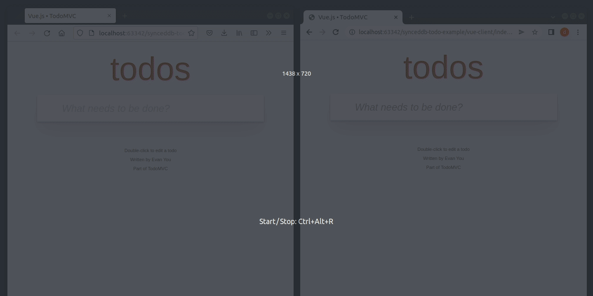

# Todo example with `synceddb`

This is a basic example showing the usage of [`synceddb`](https://github.com/darrachequesne/synceddb), a library that allows syncing an IndexedDB database with a remote REST API.

The client code is adapted from the [TodoMVC examples](https://github.com/tastejs/todomvc).
